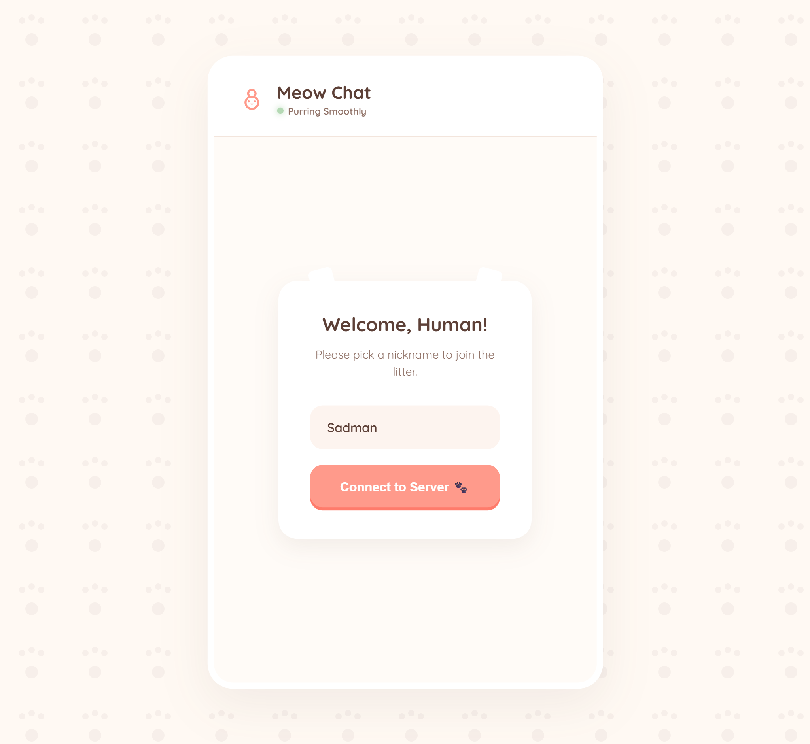
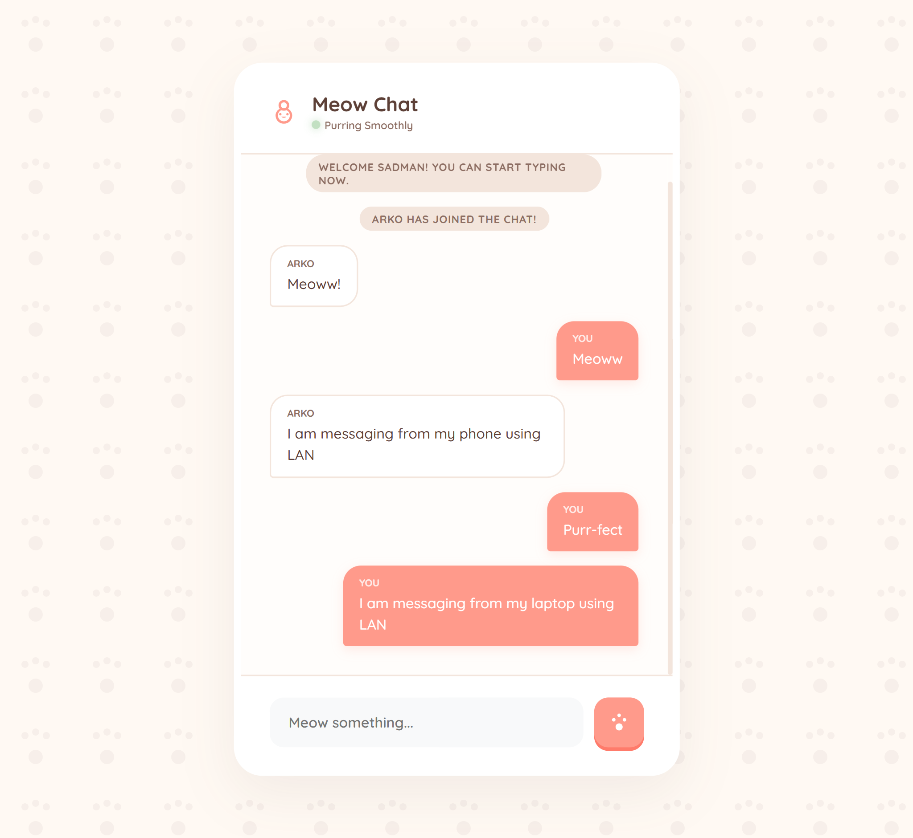
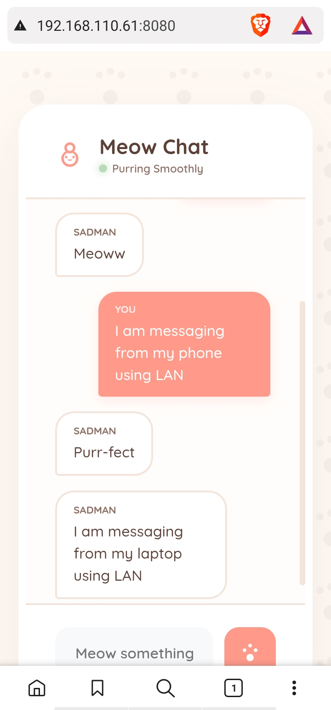

# 🐾 Meow Chat | TCP LAN Room

A robust, modular, and **purr-fectly** designed TCP-based chat application. Built with Node.js and TypeScript, this repo features a feline-friendly web UI and a high-performance TCP core.

## Preview

| Welcome Screen | Desktop Chat | Mobile Chat |
| :---: | :---: | :---: |
|  |  |  |

## Project Architecture

The project is split into modular components that communicate like a well-coordinated pack of kittens.

```text
src/
├── config/
│   └── index.ts          # Centralized configuration (ports, catnip, etc.)
├── types/
│   └── index.ts          # Shared TypeScript interfaces & types (e.g., ClientNode)
├── server/
│   ├── index.ts          # Server entry point
│   ├── ChatServer.ts     # Core server instance builder (connections, broadcasting)
│   └── ClientHandler.ts  # Handles logic specific to an individual client socket
├── client/
│   ├── index.ts          # Client entry point
│   └── ChatClient.ts     # Implements readline interface and TCP socket connection
└── web/
    ├── index.ts          # Express & WebSocket Bridge proxy server
    └── public/           # Frontend Web UI (HTML, CSS, JS)
```

## How It Works

1. **TCP Initialization:** The core server binds to a specified IP address and continuously listens for incoming raw TCP socket connections.
2. **WebSocket Bridge:** A separate bridge server (`src/web`) hosts the frontend files and simultaneously maintains a WebSocket endpoint. Whenever a browser connects to it via WebSockets, the bridge spins up a fresh `net.Socket` to bridge connection data instantly.
3. **Broadcasting Mechanism:** Every registered message triggers a `broadcast()` action on `ChatServer`, which loops over the generic connection array and dispatches the payload to every other socket attached.

## How to Run the Project

Ensure you have Node.js and npm installed.

```bash
# 1. Install dependencies
npm install

# 2. Boot up both the TCP Core Server AND the Web GUI Server simultaneously
npm start

# 3. View the Chat Web Page
# Open your browser and navigate to http://localhost:8080
```

## Accessing from Other Devices (LAN)

To access the chat from your phone or another computer on the same Wi-Fi:

1. **Find your computer's Local IP Address:**
   - **Windows:** Open Command Prompt and type `ipconfig`. Look for "IPv4 Address" under your Wi-Fi or Ethernet adapter (e.g., `192.168.x.x`).
   - **macOS/Linux:** Open Terminal and type `ifconfig` or `ip addr`. Look for the `inet` address under `en0` or `wlan0`.

2. **Connect via Browser:**
   - Open the browser on your phone/other device.
   - Type `http://<YOUR_IP_ADDRESS>:8080` (e.g., `http://192.168.110.61:8080`).

3. **Firewall Note:**
   If it doesn't load, ensure your Windows Firewall allows incoming connections on port `8080` (Web) and `3000` (TCP Server).
